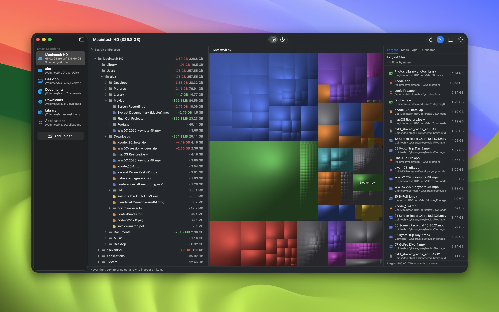
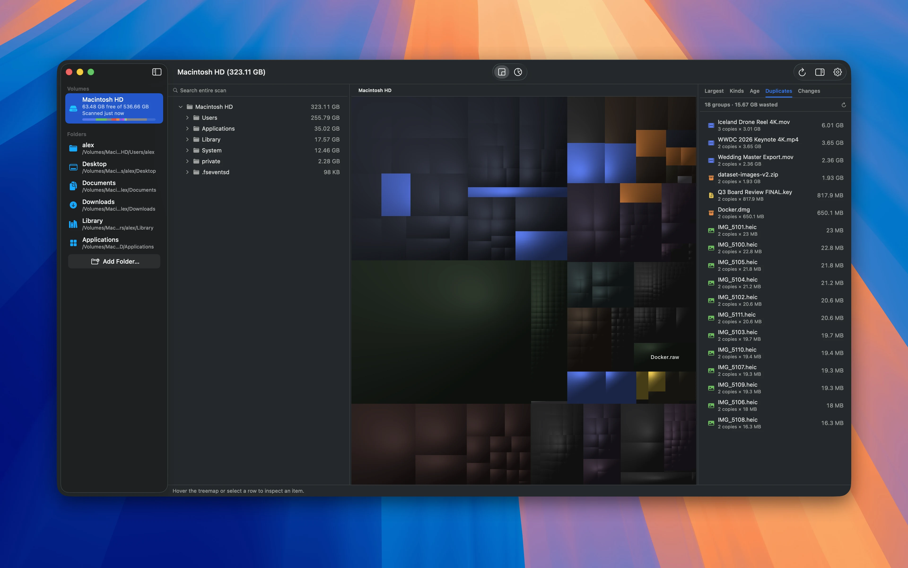
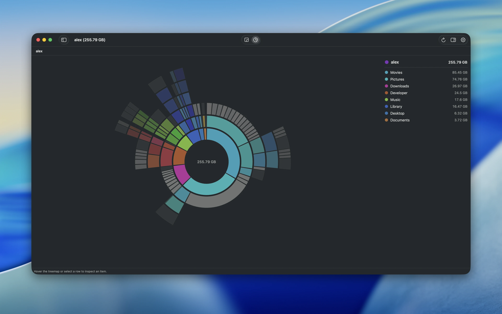

<h1 align="center">
  <br>
  <p>Neodisk</p>
</h1>

<p align="center">
  Read-only MacOS disk space visualizer.
  Treemap and sunburst views on the <code>NeodiskKit</code> scan engine.
  <br>
  <a href="https://github.com/tkslucas/Neodisk/releases/latest/download/Neodisk.dmg">Download</a>
</p>

<p align="center">
  
  
  
</p>

<p align="center">
  
  
  
</p>

## Download

[**Download Neodisk.dmg**](https://github.com/tkslucas/Neodisk/releases/latest/download/Neodisk.dmg)
and drag **Neodisk** onto the Applications folder.

Versioned builds and a `.zip` fallback are on the
[Releases](https://github.com/tkslucas/Neodisk/releases) page.

Requires macOS 14 (Sonoma) or later.

## About

**Read-only by design.** Neodisk never modifies or deletes your files. 
Instead, Reveal in Finder, Open, and Copy Path are the only file actions.
Delete and clean up safely in Finder instead.

## Features

- Treemap: pinch to zoom, scroll to pan
- Sunburst: pinch to drill in and out
- Outline selected files
- Find largest files
- File type statistics
- Age heatmap, color the treemap by last-modified date
- Duplicate finder with content-hash verified duplicates
- Fast scanning with live progress
- Search: `⌘F` fuzzy search over the entire scan
- Quick Look on spacebar
- Arrow keys move the selection in both the treemap and the sunburst
- Drill into a folder with `⌘↓`, drill back out with `⌘↑`, or click folders in the breadcrumb bar
- Snapshots, completed scans persist and reopen instantly
- Changes (+/-) toggle diffs against the previous scan to show what files grew, shrinked, got added, deleted
- Multilingual: UI follows macOS system language: English, Spanish, French, German, Italian, Brazilian Portuguese, Japanese, and Simplified Chinese

## Build & Run

Requires macOS 14+ and a Swift 6 toolchain. No Xcode needed, the Xcode
Command Line Tools are enough.

```bash
swift run -c release Neodisk    # build and launch directly
swift test                      # full test suite (engine + treemap + UI)
```

## Structure

One package, strictly layered targets:

```
Sources/
├── NeodiskKit/   # UI-free scanning core (derived from Radix)
├── NeodiskCLI/   # `diskscan`, the core's reference CLI
├── TreemapKit/   # Pure treemap geometry, viewport, rasterizer
├── NeodiskUI/    # SwiftUI/AppKit views, view model, scan lifecycle
└── Neodisk/      # Thin executable entry point
Localization/     # .lproj string catalogs, one per language
```

## Planned

- Add to Homebrew
- Multiplatform: native Windows and Linux versions (a lot of work, will
  take a while)

## Credits

- [Radix](https://github.com/colinvkim/Radix) by Colin Kim (MIT), the scan
  engine and core data model NeodiskKit is derived from, and the sunburst
  visualization is ported from. Huge inspiration.
- [Disk Inventory X](http://www.derlien.com/) by Tjark Derlien and
  [GrandPerspective](https://grandperspectiv.sourceforge.net/) by Erwin
  Bonsma, the cushion-treemap disk viewers this UI follows. No code from
  either is used.
- [DaisyDisk](https://daisydiskapp.com/) by Software Ambience, the
  sunburst-with-folder-legend layout that view follows. No code is used.
- Cushion treemaps: van Wijk & van de Wetering, INFOVIS 1999. Squarified
  treemaps: Bruls, Huizing & van Wijk, 2000.

## License

GPL-3.0-or-later. See [LICENSE](LICENSE), Radix attribution is preserved there.
