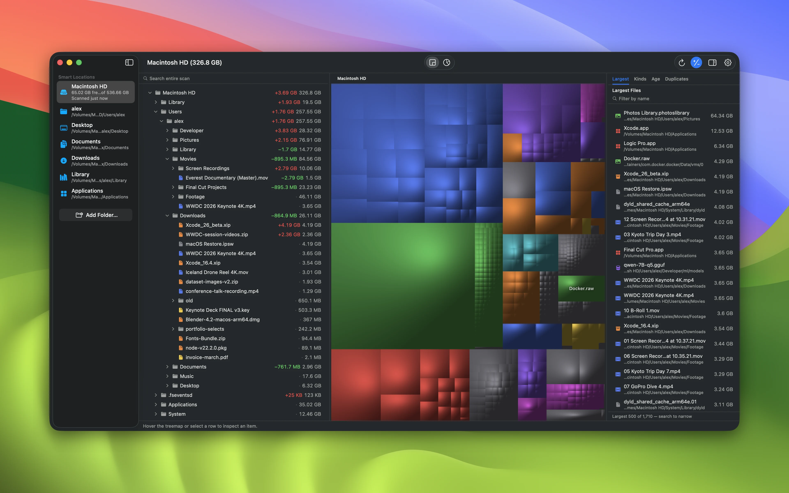
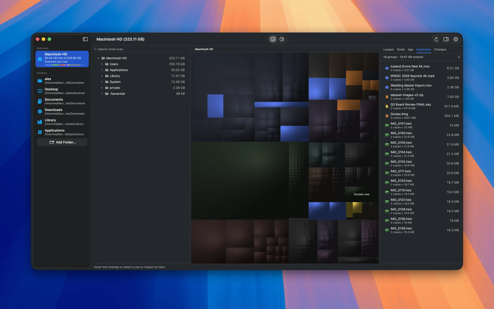
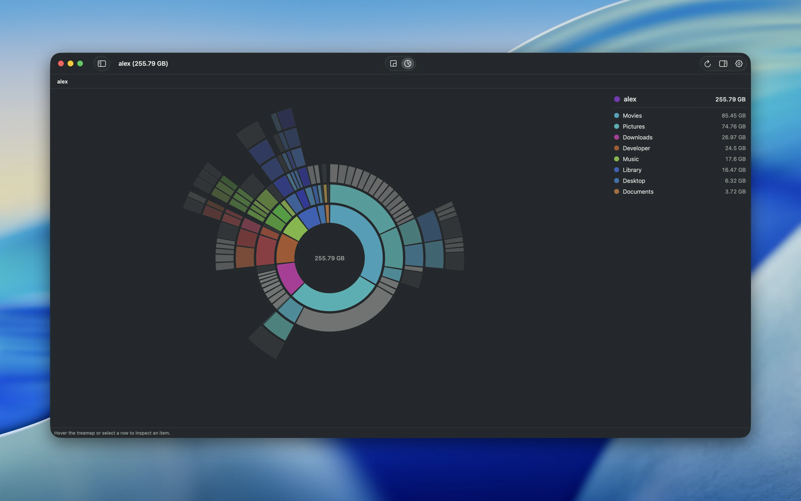

<h1 align="center">
  <br>
  <p>Neodisk</p>
</h1>

<p align="center">
  Read-only disk space visualizer for macOS and Linux.
  Treemap and sunburst views on the <code>NeodiskKit</code> scan engine.
  <br>
  <a href="https://github.com/tkslucas/Neodisk/releases/latest/download/Neodisk.dmg">Download</a>
</p>

<p align="center">
  
  
  
  
</p>

<p align="center">
  
  
  
</p>

## Download

[**Download Neodisk.dmg**](https://github.com/tkslucas/Neodisk/releases/latest/download/Neodisk.dmg)
and drag **Neodisk** onto the Applications folder.

Or with Homebrew:

```sh
brew install --cask neodisk
```

Requires macOS 14 (Sonoma) or later.

### Linux

The [nightly](https://github.com/tkslucas/Neodisk/releases/tag/nightly) has
AppImages for
[x86_64](https://github.com/tkslucas/Neodisk/releases/download/nightly/Neodisk-Nightly-x86_64.AppImage)
and
[ARM64](https://github.com/tkslucas/Neodisk/releases/download/nightly/Neodisk-Nightly-aarch64.AppImage):
make the file executable and run it. Or build and install from source
(below). The Linux app is a native GTK 4 / libadwaita application and needs
GTK 4.14 and libadwaita 1.5 or newer (Ubuntu 24.04, Fedora 40, Debian 13, and
later); the AppImage bundles them and needs a system as new as Ubuntu 24.04.

## About

**Read-only by design.** Neodisk never modifies or deletes your files.
Instead, Reveal in Finder (Show in Files on Linux), Open, and Copy Path are
the only file actions. Delete and clean up safely in your file manager
instead.

**Native on each platform.** The scan engine, tree model, treemap and
sunburst geometry, statistics, and search are one shared Swift core; the
macOS app is SwiftUI and AppKit, the Linux app is GTK 4 and libadwaita. See
[ARCHITECTURE.md](ARCHITECTURE.md).

## Features

- Treemap: pinch to zoom, scroll to pan
- Sunburst: pinch to drill in and out
- Outline selected files
- Find largest files
- File type statistics
- Age heatmap, color the treemap by last-modified date
- Duplicate finder with content-hash verified duplicates
- Fast scanning with live progress
- Search: `⌘F` fuzzy search over the entire scan
- Quick Look on spacebar (macOS)
- Arrow keys move the selection in both the treemap and the sunburst
- Drill into a folder with `⌘↓`, drill back out with `⌘↑`, or click folders in the breadcrumb bar
- Snapshots, completed scans persist and reopen instantly
- Changes tab lists what got added, deleted, renamed, grew or shrank since the previous scan (macOS)
- Show Package Contents: apps and bundles stay solid like in Finder until you expand them (macOS)
- Free and hidden space for volume scans
- Sidebar volumes show a kind-colored usage bar
- Auto-updates via Sparkle (macOS)
- Multilingual: UI follows the system language: English, Spanish, French, German, Italian, Brazilian Portuguese, Japanese, and Simplified Chinese

The Linux app covers the core views (treemap, sunburst, outline, largest
files, kind and age statistics, search, saved scans, keyboard navigation).
The duplicates and changes tabs, cloud-drive scanning, and incremental
rescans are macOS-only for now; Linux has no persistent file-change
journal, so every rescan there is a full scan.

## Build & Run

### macOS

Requires macOS 14+ and a Swift 6 toolchain. No Xcode needed, the Xcode
Command Line Tools are enough.

```bash
swift run -c release Neodisk    # build and launch directly
swift test                      # full test suite (engine + treemap + UI)
```

### Linux

Requires a Swift 6.4 toolchain ([swift.org/install](https://www.swift.org/install/linux/))
and the GTK development packages:

```bash
sudo apt install libgtk-4-dev libadwaita-1-dev libzstd-dev pkg-config   # Debian/Ubuntu
sudo dnf install gtk4-devel libadwaita-devel libzstd-devel               # Fedora

swift run -c release neodisk        # build and launch directly
swift test                          # core, shared model, treemap, cloud suites
Packaging/linux/install.sh          # install to ~/.local (menu entry, icon)
```

`install.sh` links the Swift runtime statically, so the installed app needs
only GTK 4 and libadwaita, not a Swift toolchain.

## Planned

- Windows: a native WinUI app over the same core (see
  [ARCHITECTURE.md](ARCHITECTURE.md#adding-windows))
- Linux: Flatpak packaging, the duplicates and changes tabs

## Credits

- [Disk Inventory X](http://www.derlien.com/) by Tjark Derlien and
  [GrandPerspective](https://grandperspectiv.sourceforge.net/) by Erwin
  Bonsma, the cushion-treemap disk viewers this UI follows. No code from
  either is used.
- [Radix](https://github.com/colinvkim/Radix) by Colin Kim (MIT), the scan
  engine and core data model NeodiskKit is derived from, and the sunburst
  visualization is ported from. Huge inspiration.
- [DaisyDisk](https://daisydiskapp.com/) by Software Ambience and
  [SquirrelDisk](https://github.com/adileo/squirreldisk) by Adileo, the
  sunburst disk viewers that view follows. No code from either is used.
- Cushion treemaps: van Wijk & van de Wetering, INFOVIS 1999. Squarified
  treemaps: Bruls, Huizing & van Wijk, 2000.

## License

GPL-3.0-or-later. See [LICENSE](LICENSE), Radix attribution is preserved there.
